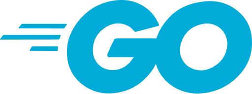

<small>Chill Mario illustration by <a href="https://www.behance.net/pixeljeff" target="_blank">Pixel Jeff</a></small>

<h2> Hi There, Welcome to my Github profile! </h2>

 
 

I'm a man who learn Front End Engineering with 2+ years of hands-on experience designing, developing and implementing applications and solutions using a range of technologies and programming languages.

I love learning new techs and using new tools. I also love drinking Luwak White Coffee and Chocolatos Drink (instant coffee and drinking chocolate in Indonesia) while coding.

 

I'm currently based in **[Tangerang, Indonesia.](https://www.google.com/maps/place/Medang,+Pagedangan,+Tangerang+Regency,+Banten/@-6.2617923,106.6069073,15z/data=!3m1!4b1!4m5!3m4!1s0x2e69fc6319d3d41d:0x782c3187e270d131!8m2!3d-6.267562!4d106.6143944)**

 

Please feel free to clone/fork projects, raise issues and submit PRs if you think something could be better. 
Ask me anything **[here](https://github.com/fadhilansyah25/fadhilansyah25/issues/new)** or <a href="mailto:fadhilansyah25@gmail.com"><b>send me an email</b></a>.

 

 
 

 
 

**Sometimes the stats might not be accurate. I recommend seeing them [here](https://github-readme-stats.vercel.app/api?username=fadhilansyah25&include_all_commits=true&count_private=true&show_icons=true&line_height=30&title_color=CDB4DB&icon_color=CDB4DB&text_color=D3D3D3&bg_color=0A0A0A)**

 

 

**Happy Coding!** 😊

<!-- # Tech Stack

 

 
 

 
 

 
 

 
 

 -->
